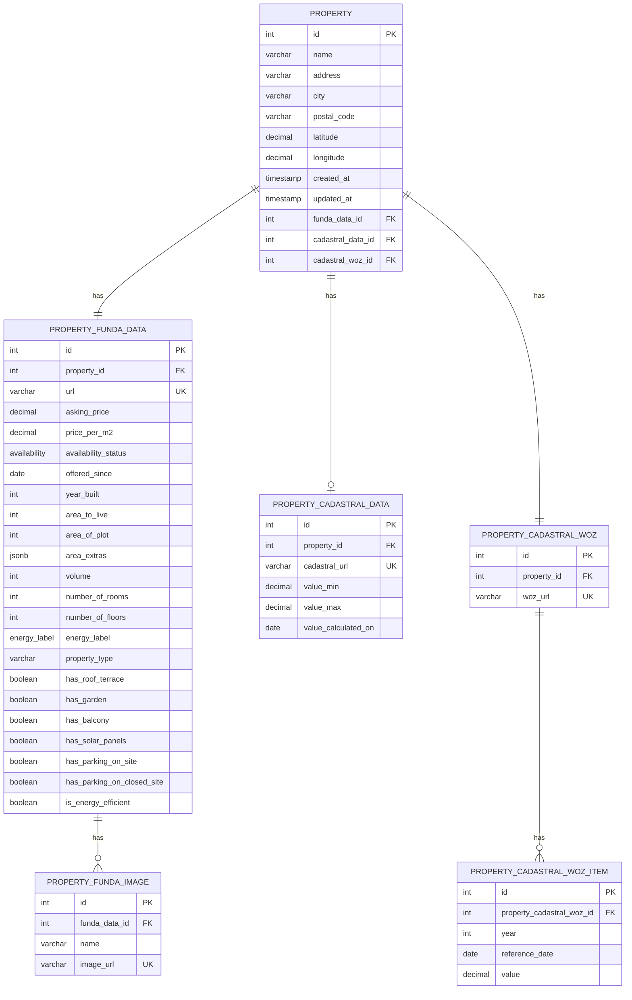

# Entity-relationship diagram

```mermaid
erDiagram
    PROPERTY {
        int id PK
        varchar name
        varchar address
        varchar city
        varchar postal_code
        decimal latitude
        decimal longitude
        timestamp created_at
        timestamp updated_at
        int funda_data_id FK
        int cadastral_data_id FK
        int cadastral_woz_id FK
    }

    PROPERTY_FUNDA_DATA {
        int id PK
        int property_id FK
        varchar url UK
        decimal asking_price
        decimal price_per_m2
        availability availability_status
        date offered_since
        int year_built
        int area_to_live
        int area_of_plot
        jsonb area_extras
        int volume
        int number_of_rooms
        int number_of_floors
        energy_label energy_label
        varchar property_type
        boolean has_roof_terrace
        boolean has_garden
        boolean has_balcony
        boolean has_solar_panels
        boolean has_parking_on_site
        boolean has_parking_on_closed_site
        boolean is_energy_efficient
    }

    PROPERTY_FUNDA_IMAGE {
        int id PK
        int funda_data_id FK
        varchar name
        varchar image_url UK
    }

    PROPERTY_CADASTRAL_DATA {
        int id PK
        int property_id FK
        varchar cadastral_url UK
        decimal value_min
        decimal value_max
        date value_calculated_on
    }

    PROPERTY_CADASTRAL_WOZ {
        int id PK
        int property_id FK
        varchar woz_url UK
    }

    PROPERTY_CADASTRAL_WOZ_ITEM {
        int id PK
        int property_cadastral_woz_id FK
        int year
        date reference_date
        decimal value
    }
    
    PROPERTY ||--|| PROPERTY_FUNDA_DATA : "has"
    PROPERTY_FUNDA_DATA ||--o{ PROPERTY_FUNDA_IMAGE : "has"
    PROPERTY ||--o| PROPERTY_CADASTRAL_DATA : "has"
    PROPERTY ||--|| PROPERTY_CADASTRAL_WOZ : "has"
    PROPERTY_CADASTRAL_WOZ ||--o{ PROPERTY_CADASTRAL_WOZ_ITEM : "has"
```
